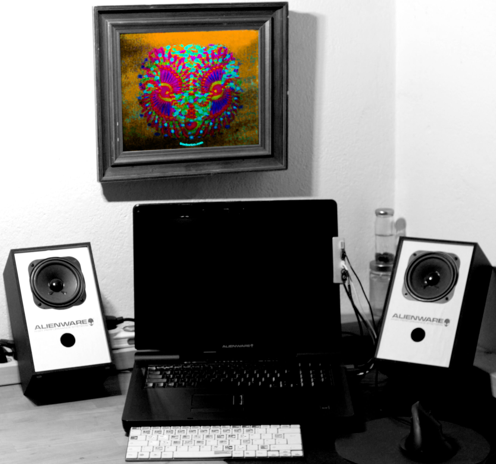
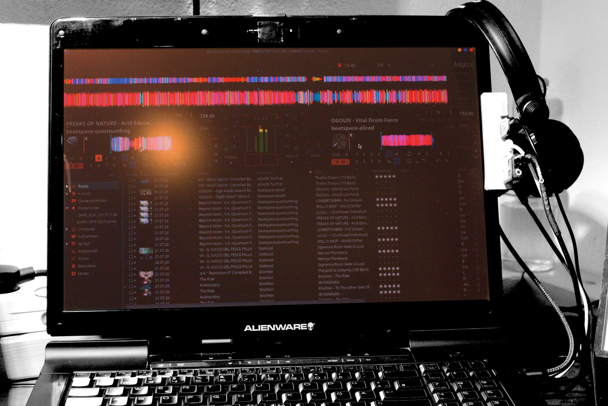

# Alienware KDE neon DJ-Maschine

## Version 1.0.0 – Stable

> **Ein Revitalisierungsprojekt auf Basis eines Alienware m17x (2008)**
>
> *Revitalisierung statt ersetzen.*

Eine stabile Linux-DJ-Plattform auf Basis eines Alienware m17x aus dem Jahr 2008.

Dieses Projekt dokumentiert die Modernisierung und Optimierung eines 1.Gen. Alienware-Notebooks zu einer extraordinären und stabilen DJ-Maschine unter Linux. Ziel war nicht maximale Rechenleistung, sondern eine solide Audio-Plattform mit geringer Systemlast, hoher Zuverlässigkeit und nachhaltiger Weiterverwendung hochwertiger Hardware.

Nach Abschluss aller Optimierungen arbeitet das System im Langzeittest stabil, knisterfrei und mit hervorragender Audioqualität.

## Setup Fotos



Das Masterpice im Bilderrahmen ist von trootootoo 

 

---

## Projektziel

Ziel des Projekts war der Aufbau einer möglichst schlanken und zuverlässigen Linux-DJ-Plattform.

Die Maschine wird ausschließlich für folgende Aufgaben eingesetzt:

- Mixxx DJ Software
- Audioausgabe
- Musikverwaltung
- Wartung und Systemupdates

Eine Internetverbindung wird ausschließlich für Wartung, Updates und Softwareinstallation verwendet.

Prioritäten des Projekts:

- Stabilität vor maximaler Leistung
- geringe Systemlast vor unnötigen Funktionen
- Reparierbarkeit vor Austausch
- nachhaltige Nutzung vorhandener Hardware

---

## Projektstatus

**Version 1.0.0 – Stable**

Das Projektziel wurde erreicht.

Die Basisplattform ist vollständig optimiert und erfolgreich im Langzeittest erprobt.

Ab dieser Version erfolgen keine grundlegenden Änderungen am Betriebssystem.

Künftige Arbeiten betreffen ausschließlich:

- funktionale Erweiterungen
- Aktualisierung einzelner Komponenten
- Weiterentwicklung der Dokumentation

---

## Hardware-Upgrade

Die Modernisierung erfolgte mit Komponenten, die für den Alienware m17x (2008) heute noch verfügbar waren und ohne aufwendige Umbauten integriert werden konnten.

| Komponente | Upgrade | Kosten |
|------------|---------|-------:|
| SSD | Samsung 870 EVO 500 GB | ca. 90 € |
| Arbeitsspeicher | Erweiterung von 2 GB auf 4 GB | ca. 10 € |

**Gesamtinvestition:** ca. **100 €**

Mit diesen beiden Upgrades entstand aus einem Alienware m17x (2008) eine vollständig einsatzfähige Linux-DJ-Maschine.

---

## Wirtschaftlichkeit

Dieses Projekt zeigt, dass hochwertige Hardware auch nach vielen Jahren sinnvoll weiter genutzt werden kann.

### Vorteile

- erste Alienware-Generation erhalten
- Investition von lediglich ca. 100 €
- reparaturfreundliche Hardware
- Verlängerung der Nutzungsdauer
- nachhaltige Wiederverwendung vorhandener Komponenten

Die Entscheidung gegen eine Neuanschaffung war keine Einschränkung, sondern eine bewusste technische und wirtschaftliche Entscheidung.

---

## Gehäuse und Design

Ein wesentlicher Faktor für den Erhalt des Systems ist das außergewöhnliche Gehäusedesign des frühen Alienware m17x.

Besondere Merkmale:

- Magnesium-Aluminium-Gehäuse
- gummierte **„Stealth Black Soft-Touch“**-Oberfläche
- matte, reflexionsarme Oberfläche
- griffige Haptik
- robuste Konstruktion
- dezentes, funktionales Erscheinungsbild

Modelle mit dieser Gehäuseausführung sind heute nur noch selten anzutreffen.

Der Erhalt des Systems war daher nicht nur eine technische, sondern auch eine ästhetische Entscheidung.

---

## Hardware

| Komponente | Spezifikation |
|------------|---------------|
| Modell | Alienware m17x (2008) |
| CPU | Intel Core 2 Duo P8400 |
| Kerne | 2 |
| Taktfrequenz | 2,26 GHz |
| RAM | 3,8 GiB |
| SSD | Samsung 870 EVO 500 GB |
| GPU | AMD Mobility Radeon |
| Grafikspeicher | 512 MB |

## Betriebssystem

| Komponente | Version |
|------------|---------|
| Distribution | KDE neon |
| Kernel | 7.0.0-28-generic |
| Audio-System | PipeWire |
| Session Manager | WirePlumber |
| Echtzeit-Unterstützung | RTKit |
| DJ-Software | Mixxx 2.5.6 |

Das System wurde ausschließlich für den DJ-Betrieb optimiert.

---

## Kernel

Während der Entwicklung wurden mehrere Linux-Kernel erfolgreich getestet.

| Kernel | Status |
|---------|--------|
| 7.0.0-28-generic | **Produktiv** |
| 6.8.0-134-lowlatency | erfolgreich getestet |
| 6.17.0-40-generic | erfolgreich getestet |

Der produktive Betrieb erfolgt mit dem **Linux 7.0.0-28-generic**-Kernel.

Nach den durchgeführten Tests bot dieser Kernel die beste Kombination aus Stabilität, Kompatibilität und Audioleistung für den vorgesehenen Einsatzzweck.

---

## Systemoptimierung

Der Schwerpunkt der Optimierung lag auf einer stabilen Audioverarbeitung bei möglichst geringer Systemlast.

Optimierungsziele:

- geringe Hintergrundaktivität
- konstante CPU-Leistung
- stabile Audiowiedergabe
- kurze Bootzeit
- reproduzierbares Systemverhalten

---

## CPU

### Governor

```bash
performance
```

Ergebnis:

- konstante CPU-Leistung
- keine CPU-Peaks im Normalbetrieb
- stabile Audioverarbeitung

Die CPU erwies sich im Verlauf der Analyse nicht als limitierender Faktor.

---

## Bootzeit

Analyse:

```bash
systemd-analyze
```

| Bereich | Zeit |
|---------|-----:|
| Kernel | ca. 6 Sekunden |
| Userspace | ca. 18 Sekunden |
| Gesamt | ca. 24 Sekunden |

Für ein System aus dem Jahr 2008 stellt dies ein sehr gutes Ergebnis dar.

---

## Arbeitsspeicher

| Bereich | Wert |
|---------|-----:|
| Gesamter RAM | 3,8 GiB |
| Belegt | ca. 1,4 GiB |
| Verfügbar | ca. 2,4 GiB |
| Swap | 8,4 GiB |

Während des DJ-Betriebs erfolgt keine erkennbare Swap-Nutzung.

---

## Deaktivierte Dienste

### Drucksystem

Deaktiviert:

```text
cups.service
cups.path
cups-browsed.service
```

Status:

```text
masked
```

Da keine Druckfunktion benötigt wird.

### Samba

Deaktiviert:

```text
nmbd.service
samba-ad-dc.service
```

Status:

```text
masked
```

Aktiv:

```text
smbd.service
```

Die Freigabe bleibt für eine spätere Übertragung von Musikdateien über das Netzwerk erhalten.

---

## Audio-System

Verwendete Komponenten:

- PipeWire
- WirePlumber
- RTKit
- ALSA

Diese Kombination ermöglicht eine moderne Linux-Audioverwaltung bei hoher Stabilität und guter Kompatibilität mit Mixxx.

---

## Mixxx-Start

Mixxx wird mit folgendem Umgebungsparameter gestartet:

```bash
PA_ALSA_PLUGHW=1
```

Im KDE-Menü-Editor wird der Parameter unter **Befehlszeilen-Argumente** eingetragen.

Dadurch kann Mixxx das Master-Audiointerface zuverlässig über ALSA öffnen, ohne das man es bei jedem Start manuell eintragen muss.

---

## Audio-Hardware

| Funktion | Gerät | Native Samplerate |
|----------|-------|------------------:|
| Master | USB Audio Device | 46.875 Hz |
| Cue | C-Media USB Soundkarte für Headphone | 44.100 Hz / 48.000 Hz |

Startparameter:

```bash
PA_ALSA_PLUGHW=1
```

Dadurch kann Mixxx das Master-Gerät zuverlässig öffnen.

---

## Mixxx

| Bereich | Einstellung |
|---------|-------------|
| Version | 2.5.6 |
| Audio API | ALSA |
| Decks | 4 |
| Master | USB Audio Device |
| Cue | C-Media USB Headphone |

Ergebnis:

- stabiler Vier-Deck-Betrieb
- stabile Master-Ausgabe
- stabiles Kopfhörer-Vorhören
- sehr geringe CPU-Auslastung
- fehlerfreier Einzelbetrieb beider USB-Audiointerfaces

---

## Analyse

Während der Entwicklung wurden systematisch untersucht:

- CPU-Leistung
- Arbeitsspeicher
- Linux-Kernel
- PipeWire
- WirePlumber
- ALSA
- Mixxx
- unterschiedliche USB-Sampleraten

CPU, Kernel, Arbeitsspeicher und allgemeine Systemleistung konnten als Hauptursache der ursprünglichen Audioprobleme ausgeschlossen werden.

## Langzeittest

Nach Abschluss aller Optimierungen wurde das System über einen längeren Zeitraum unter realen Einsatzbedingungen getestet.

Konfiguration:

| Gerät | Lautstärke |
|--------|-----------:|
| USB Audio Device | 90 % |
| C-Media USB Headphone | 90 % |

Ergebnis:

- stabiler Vier-Deck-Betrieb
- gleichzeitiger Betrieb beider USB-Audiointerfaces
- stabile Master-Ausgabe
- stabiles Kopfhörer-Vorhören
- keine CPU-Peaks
- kein Audioknistern
- keine Aussetzer
- hervorragende Klangqualität

---

## Technische Erkenntnisse

Die Entwicklung verlief in mehreren aufeinander aufbauenden Analyse- und Testphasen.

Untersucht wurden unter anderem:

- CPU-Leistung
- Arbeitsspeicher
- Linux-Kernel
- Audio-Stack
- Mixxx
- USB-Audiointerfaces
- unterschiedliche native Sampleraten

Mehrere Arbeitshypothesen konnten im Verlauf der Untersuchungen ausgeschlossen oder angepasst werden.

Die erreichte Stabilität entstand nicht durch eine einzelne Änderung, sondern durch das Zusammenspiel aller vorgenommenen Optimierungen.

### Gerätepegel

Während der Fehlersuche wurden die Gerätepegel beider USB-Audiointerfaces
testweise auf 50 % reduziert.

Nach weiteren Langzeittests konnten beide Geräte dauerhaft mit **90 %**
betrieben werden, ohne dass CPU-Peaks oder Audioknistern erneut auftraten.

Die zwischenzeitliche Reduzierung der Gerätepegel erwies sich damit als
wertvoller Zwischenschritt der Analyse, nicht jedoch als notwendige
Betriebseinstellung.

---

## Projektergebnis

Mit einer Gesamtinvestition von rund **100 €** entstand aus einem Alienware m17x (2008) eine zuverlässige Linux-DJ-Maschine für den produktiven Einsatz.

Erreicht wurden:

- stabile Linux-Plattform
- moderne Audio-Infrastruktur
- geringe Systemlast
- kurze Bootzeit
- zuverlässiger Langzeitbetrieb
- hervorragende Audioqualität
- nachhaltige Weiterverwendung hochwertiger Hardware

---

## Projektphilosophie

Dieses Projekt zeigt, dass hochwertige Hardware auch nach vielen Jahren sinnvoll weiter genutzt werden kann.

Der Fokus lag nicht auf maximaler Rechenleistung, sondern auf Stabilität, Reparierbarkeit und nachhaltiger Nutzung.

Aus einem Alienware m17x (2008) entstand Schritt für Schritt eine zuverlässige Linux-DJ-Maschine für den produktiven Einsatz.

---

## Die Magie des Projekts

Die eigentliche Magie lag nicht in einem einzelnen Fix.

Sie entstand aus Disziplin, Geduld und den richtigen Intuitionen im Zusammenspiel von Mensch und Soft- und Hardware.

Aus vielen kleinen Beobachtungen, Tests und Erkenntnissen entwickelte sich Schritt für Schritt eine stabile und reproduzierbare Lösung.

---

> **Version 1.0.0 – Stable**

> *Revitalisierung statt ersetzen.*
